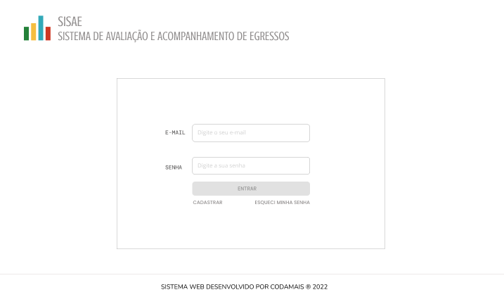
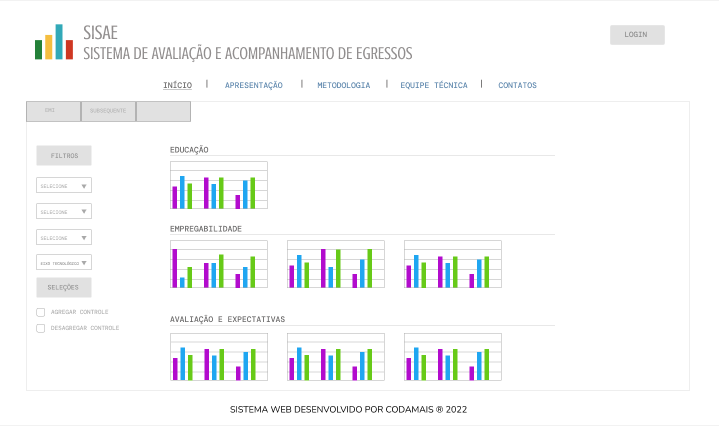
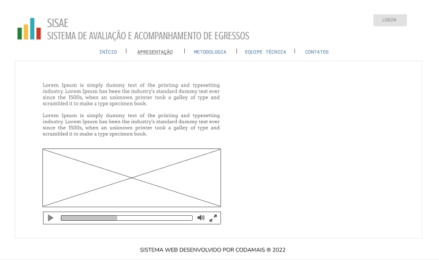
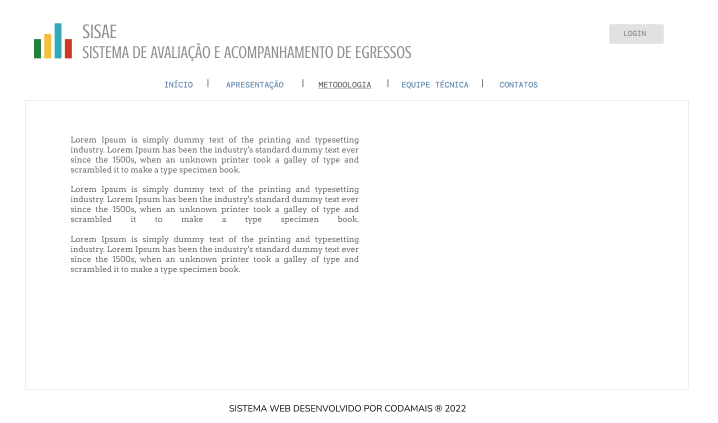
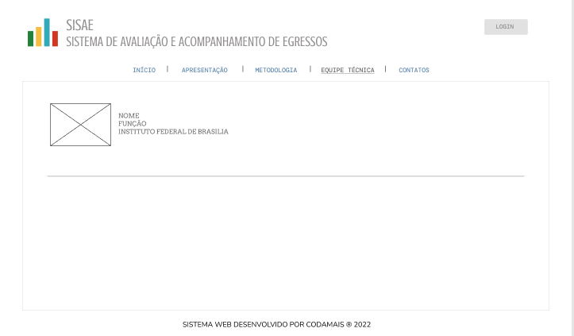
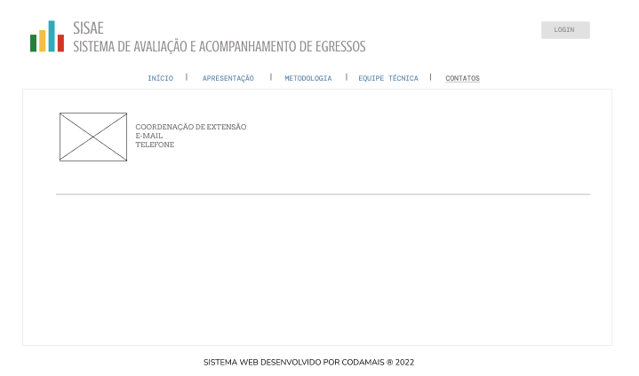
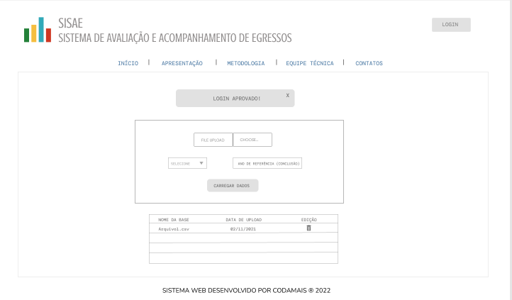

<h1>Projeto Avaliação de Egressos
</h1>

## Índice

*[Sobre](#📕sobre-o-projeto)
*[Ferramentas usadas](#🔨ferramentas-usadas)
*[Como contribuir](#como-contribuir)
*[Colaboradores](#colaboradores)

## 📕Sobre o projeto
<p align = "Justify">O sistema SISAE tem como objetivo principal a alimentação, visualização e  acompanhamento de informações dos egressos do IFB relativos ao mercado de trabalho e continuação dos estudos. O SISAE contará também com o acompanhamento de um grupo de controle que, assim como o de egressos, será  contatado após um ano para a coleta dos dados.</p>

|  |  |  |  | 
|:---:| :---:| :---: | :---: |

 |  |  |
| :---:| :---: | :---: | 

## 🔨Ferramentas usadas
- [JavaScript](https://developer.mozilla.org/en-US/docs/Web/JavaScript)
- [React](https://pt-br.reactjs.org/docs/getting-started.html)
- [CSS](https://developer.mozilla.org/pt-BR/docs/Web/CSS)
- [HTML](https://developer.mozilla.org/pt-BR/docs/Web/HTML)

## Como contribuir
```bash
    # Clone the project
    $ git clone 
```

```bash
    $ cd ProjetoAvaliaçãoDeEgressos
```

```bash
    #Install the dependencies, if use npm
    $ npm install
```
<p>ou</p>

```bash
    $ yarn
```
## Colaboradores

<p> Front-end: </p>

| [<br><sub>Talison Yago</sub>](https://github.com/talisonyago) | 
| :---: |
| [<br><sub>Isamara Galvão</sub>](https://github.com/isamarags) | 

---
<h4 align="center"> 🚧 Projeto README em construção... 🚀 🚧
